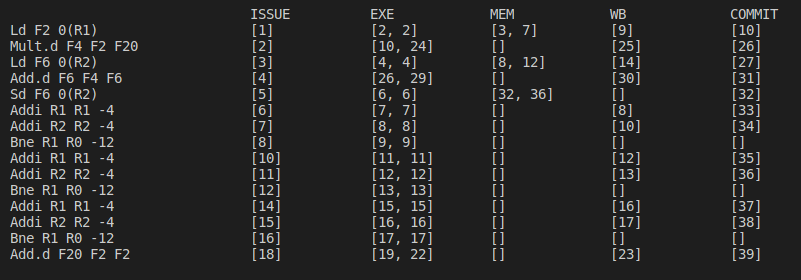

# Dynamic Scheduling of Instructions


## Tomasulo Algorithm
### Useful documents for read: (with respectively)
   - [CS422](https://www.cse.iitk.ac.in/users/biswap/CS422/L12-Tomasulo.pdf), Indian Institute of Technology Kanpur
   - [CS425](https://www.info425.ece.mcgill.ca/tutorials/T06-Tomasulo.pdf), Mcgill University


### Useful videos:
   - [Tomasulo's Algorithm Introduction](https://www.youtube.com/watch?v=vJeqr9KXqqs&t=525s)
   - [Tomasulo's Algorithm example](https://www.youtube.com/watch?v=uKhFewz4cWA)

This videos are very useful for understanding of Tomasulo Algorithm.


### Simulator:
In this code we developed a python code for simulation Tomasulo algorithm. You can check source code [here](https://github.com/M-Sc-AUT/M.Sc-Computer-Architecture/tree/main/Advanced%20Computer%20Architecture/Useful%20Documents/Simulator/Tomasulo)

#### How run?
- In first, you should write an instruction in assembly code in ``code.in`` file like below:

```asm
Ld F2 0(R1)
Mult.d F4 F2 F20
Ld F6 0(R2)
Add.d F6 F4 F6
Sd F6 0(R2)
Addi R1 R1 -4
Addi R2 R2 -4
Bne R1 R0 -12
Add.d F20 F2 F2
```
- After write instructions code, you should run ``main.py`` file with this command:

``` 
$ python3 main.py
 ```
- The output of the code is as follows:




## Scoreboarding Algorithm
### Useful documents for read: (with respectively)
   - [CS252](https://people.eecs.berkeley.edu/~kubitron/courses/cs252-S12/lectures/lec07-dynasched2.pdf), Berkeley University
   - [CS252](http://users.utcluj.ro/~sebestyen/_Word_docs/Cursuri/SSC_course_5_Scoreboard_ex.pdf), Technical University of Cluj-Napoca


### Useful videos:
   - [Score boarding Introduction](https://www.youtube.com/watch?v=nOd0VSkeE0A)
   - [Score Boarding Example](https://www.youtube.com/watch?v=ewl_wXY0d2E)


This videos are very useful for understanding of Score Boarding Algorithm.


### Simulator:
In this code we developed a python code for simulation Scoreboarding algorithm. You can check source code [here](https://github.com/M-Sc-AUT/M.Sc-Computer-Architecture/tree/main/Advanced%20Computer%20Architecture/Useful%20Documents/Simulator/Scoreboarding)

#### How run?
- In first, you should write an instruction in assembly code in ``scoreboard.asm`` file like below:

```asm
.integer 1 1
.mult 2 10
.add 1 2
.div 1 40
LD    F6,   34(R2)
LD    F2,   45(R3)
MULTD F0,   F2, F4
SUBD  F8,   F6, F2
DIVD  F10,  F0, F6
ADDD  F6,   F8, F2
```
- After write instructions code, you should run ``scoreboard.py`` file with this command:

``` 
$ python3 scoreboard.py
 ```
- The output of the code is as follows:


