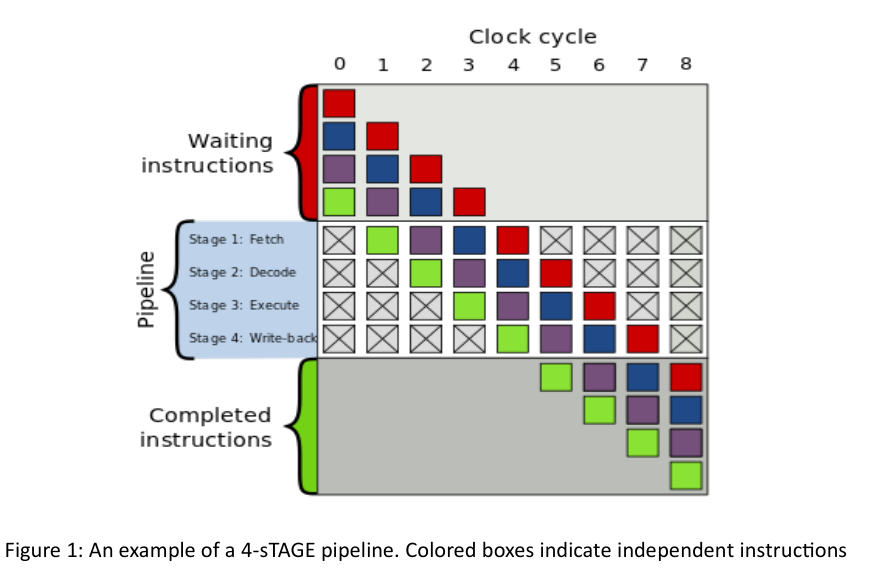
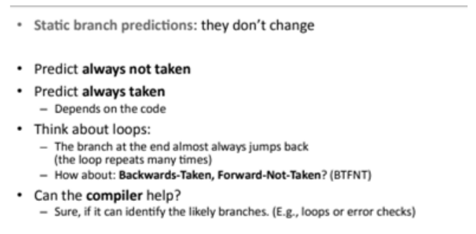

# Dynamic Scheduling of Instructions


## Tomasulo Algorithm
### Useful documents for read: (with respectively)
   - [CS422](https://www.cse.iitk.ac.in/users/biswap/CS422/L12-Tomasulo.pdf), Indian Institute of Technology Kanpur
   - [CS425](https://www.info425.ece.mcgill.ca/tutorials/T06-Tomasulo.pdf), Mcgill University


### Useful videos:
   - [Tomasulo's Algorithm Introduction](https://www.youtube.com/watch?v=vJeqr9KXqqs&t=525s)
   - [Tomasulo's Algorithm example](https://www.youtube.com/watch?v=uKhFewz4cWA)

This videos are very useful for understanding of Tomasulo Algorithm.


### Simulator:
In this code we developed a python code for simulation Tomasulo algorithm. You can check source code [here](https://github.com/M-Sc-AUT/M.Sc-Computer-Architecture/tree/main/Advanced%20Computer%20Architecture/Useful%20Documents/Simulator/Tomasulo)

#### How run?
- In first, you should write an instruction in assembly code in ``code.in`` file like below:

```asm
Ld F2 0(R1)
Mult.d F4 F2 F20
Ld F6 0(R2)
Add.d F6 F4 F6
Sd F6 0(R2)
Addi R1 R1 -4
Addi R2 R2 -4
Bne R1 R0 -12
Add.d F20 F2 F2
```
- After write instructions code, you should run ``main.py`` file with this command:

``` 
$ python3 main.py
 ```
- The output of the code is as follows:


## Scoreboarding Algorithm
### Useful documents for read: (with respectively)
   - [CS252](https://people.eecs.berkeley.edu/~kubitron/courses/cs252-S12/lectures/lec07-dynasched2.pdf), Berkeley University
   - [CS252](http://users.utcluj.ro/~sebestyen/_Word_docs/Cursuri/SSC_course_5_Scoreboard_ex.pdf), Technical University of Cluj-Napoca


### Useful videos:
   - [Score boarding Introduction](https://www.youtube.com/watch?v=nOd0VSkeE0A)
   - [Score Boarding Example](https://www.youtube.com/watch?v=ewl_wXY0d2E)


This videos are very useful for understanding of Score Boarding Algorithm.


### Simulator:
In this code we developed a python code for simulation Scoreboarding algorithm. You can check source code [here](https://github.com/M-Sc-AUT/M.Sc-Computer-Architecture/tree/main/Advanced%20Computer%20Architecture/Useful%20Documents/Simulator/Scoreboarding)

#### How run?
- In first, you should write an instruction in assembly code in ``scoreboard.asm`` file like below:

```asm
.integer 1 1
.mult 2 10
.add 1 2
.div 1 40
LD    F6,   34(R2)
LD    F2,   45(R3)
MULTD F0,   F2, F4
SUBD  F8,   F6, F2
DIVD  F10,  F0, F6
ADDD  F6,   F8, F2
```
- After write instructions code, you should run ``scoreboard.py`` file with this command:

``` 
$ python3 scoreboard.py
 ```
- The output of the code is as follows:


# Branch Prediction
In computer architecture, a branch predictor is a digital circuit that tries to guess which way a branch (e.g., an if–
then–else structure) will go before this is known definitively. The purpose of the branch predictor is to improve
the flow in the instruction pipeline. Branch predictors play a critical role in achieving high performance in many
modern pipelined microprocessor architectures.


Junction jumping is usually implemented with a conditional jump instruction. A jump condition can either be "not-
taken" and continue execution with the first code jump immediately after the conditional jump, or it can be "taken"
and jump to a different location in program memory, where the second code jump is stored. It is not known exactly
whether the conditional jump will be taken or not-taken until it is calculated and the conditional jump passes
through the execution part of the pipeline. pass, it waits before the next instruction in the pipeline can enter fetch
mode. Jump prediction tries to avoid wasting time by trying to guess whether a conditional jump is likely to be
taken or not taken. A guess is most likely fetched and executed speculatively. If it is later determined that the
guess was wrong, then the speculative execution or execution of a portion of the executed instructions is ignored
and the pipeline starts over with the correct jump, imposing a delay.


The time wasted in misprediction is equal to the number of steps in the pipeline. From the fetch stage to the
execution stage. Newer microprocessors tend to have relatively long pipelines so that latency mispredictions occur
between 10 and 20 clock cycles. Consequently, making a longer pipeline increases the need for more advanced
jump prediction.


The first time a conditional jump execution is encountered, there is not much information based on the
prediction. But the jump prediction keeps the information whether the jumps are taken or not. When it encounters
a conditional jump that it has encountered several times, it can base the prediction on history. Jump prediction
may, for example, detect whether a conditional jump is performed often, or if it is performed once in a while.




## Static Branch Predictor



A static branch predictor is a simple branch prediction technique used in computer architecture. It does not rely
on the dynamic history of code execution. Instead, it predicts the outcome of a branch based solely on the
branch instruction.


In computer architecture, a branch predictor is a digital circuit that tries to guess which way a branch (e.g., an if–
then–else structure) will go before this is known definitively. The purpose of the branch predictor is to improve
the flow in the instruction pipeline1.


In the case of static branch prediction, the underlying hardware assumes that either the branch is not taken
always or the branch is taken always. For example, consider the following code:


```c
int a = 0;
while (a < 5)
{
   // branch instruction, condition either true or false
   if(a % 2 == 0) {.....}
   a++;
}
```   


