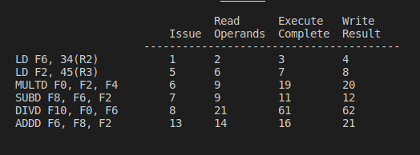

# Dynamic Scheduling of Instructions


## Tomasulo Algorithm
### Useful documents for read: (with respectively)
   - [CS422](https://www.cse.iitk.ac.in/users/biswap/CS422/L12-Tomasulo.pdf), Indian Institute of Technology Kanpur
   - [CS425](https://www.info425.ece.mcgill.ca/tutorials/T06-Tomasulo.pdf), Mcgill University


### Useful videos:
   - [Tomasulo's Algorithm Introduction](https://www.youtube.com/watch?v=vJeqr9KXqqs&t=525s)
   - [Tomasulo's Algorithm example](https://www.youtube.com/watch?v=uKhFewz4cWA)

This videos are very useful for understanding of Tomasulo Algorithm.


### Simulator:
In this code we developed a python code for simulation Tomasulo algorithm. You can check source code [here](https://github.com/M-Sc-AUT/M.Sc-Computer-Architecture/tree/main/Advanced%20Computer%20Architecture/Useful%20Documents/Simulator/Tomasulo)

#### How run?
- In first, you should write an instruction in assembly code in ``code.in`` file like below:

```asm
Ld F2 0(R1)
Mult.d F4 F2 F20
Ld F6 0(R2)
Add.d F6 F4 F6
Sd F6 0(R2)
Addi R1 R1 -4
Addi R2 R2 -4
Bne R1 R0 -12
Add.d F20 F2 F2
```
- After write instructions code, you should run ``main.py`` file with this command:

``` 
$ python3 main.py
 ```
- The output of the code is as follows:


## Scoreboarding Algorithm
### Useful documents for read: (with respectively)
   - [CS252](https://people.eecs.berkeley.edu/~kubitron/courses/cs252-S12/lectures/lec07-dynasched2.pdf), Berkeley University
   - [CS252](http://users.utcluj.ro/~sebestyen/_Word_docs/Cursuri/SSC_course_5_Scoreboard_ex.pdf), Technical University of Cluj-Napoca


### Useful videos:
   - [Score boarding Introduction](https://www.youtube.com/watch?v=nOd0VSkeE0A)
   - [Score Boarding Example](https://www.youtube.com/watch?v=ewl_wXY0d2E)


This videos are very useful for understanding of Score Boarding Algorithm.


### Simulator:
In this code we developed a python code for simulation Scoreboarding algorithm. You can check source code [here](https://github.com/M-Sc-AUT/M.Sc-Computer-Architecture/tree/main/Advanced%20Computer%20Architecture/Useful%20Documents/Simulator/Scoreboarding)

#### How run?
- In first, you should write an instruction in assembly code in ``scoreboard.asm`` file like below:

```asm
.integer 1 1
.mult 2 10
.add 1 2
.div 1 40
LD    F6,   34(R2)
LD    F2,   45(R3)
MULTD F0,   F2, F4
SUBD  F8,   F6, F2
DIVD  F10,  F0, F6
ADDD  F6,   F8, F2
```
- After write instructions code, you should run ``scoreboard.py`` file with this command:

``` 
$ python3 scoreboard.py
 ```
- The output of the code is as follows:




# Branch Prediction
In computer architecture, a branch predictor is a digital circuit that tries to guess which way a branch (e.g., an if–
then–else structure) will go before this is known definitively. The purpose of the branch predictor is to improve
the flow in the instruction pipeline. Branch predictors play a critical role in achieving high performance in many
modern pipelined microprocessor architectures.


Junction jumping is usually implemented with a conditional jump instruction. A jump condition can either be "not-
taken" and continue execution with the first code jump immediately after the conditional jump, or it can be "taken"
and jump to a different location in program memory, where the second code jump is stored. It is not known exactly
whether the conditional jump will be taken or not-taken until it is calculated and the conditional jump passes
through the execution part of the pipeline. pass, it waits before the next instruction in the pipeline can enter fetch
mode. Jump prediction tries to avoid wasting time by trying to guess whether a conditional jump is likely to be
taken or not taken. A guess is most likely fetched and executed speculatively. If it is later determined that the
guess was wrong, then the speculative execution or execution of a portion of the executed instructions is ignored
and the pipeline starts over with the correct jump, imposing a delay.


The time wasted in misprediction is equal to the number of steps in the pipeline. From the fetch stage to the
execution stage. Newer microprocessors tend to have relatively long pipelines so that latency mispredictions occur
between 10 and 20 clock cycles. Consequently, making a longer pipeline increases the need for more advanced
jump prediction.


The first time a conditional jump execution is encountered, there is not much information based on the
prediction. But the jump prediction keeps the information whether the jumps are taken or not. When it encounters
a conditional jump that it has encountered several times, it can base the prediction on history. Jump prediction
may, for example, detect whether a conditional jump is performed often, or if it is performed once in a while.


## Static Branch Predictor


A static branch predictor is a simple branch prediction technique used in computer architecture. It does not rely
on the dynamic history of code execution. Instead, it predicts the outcome of a branch based solely on the
branch instruction.


In computer architecture, a branch predictor is a digital circuit that tries to guess which way a branch (e.g., an if–
then–else structure) will go before this is known definitively. The purpose of the branch predictor is to improve
the flow in the instruction pipeline1.


In the case of static branch prediction, the underlying hardware assumes that either the branch is not taken
always or the branch is taken always. For example, consider the following code:


```c
int a = 0;
while (a < 5)
{
   // branch instruction, condition either true or false
   if(a % 2 == 0) {.....}
   a++;
}
```

In this case, the static branch prediction technique would make an assumption about whether the if condition is
true or false.


The first time a conditional jump instruction is encountered, there is not much information to base a prediction
on. But the branch predictor keeps records of whether branches are taken or not taken. When it encounters a
conditional jump that has been seen several times before, then it can base the prediction on the history1.


However, it’s important to note that static prediction is easier than dynamic prediction. Also, the compiler can
determine whether a branch is likely to be taken or not taken based on analysis or profile information.


## Next line predictor
The NLP is a branch prediction technique used to improve instruction fetching efficiency.

Unlike more complex predictors, the NLP focuses on predicting whether the next instruction (i.e., the one
immediately following the current instruction) will be executed or not.


It operates at the instruction level, aiming to minimize pipeline stalls caused by incorrect predictions.


### How NLP Works:
The NLP doesn’t rely on extensive historical data or complex state machines.
Instead, it uses simple heuristics based on observed patterns during execution.
Here’s how it typically works:
When an instruction is fetched, the NLP predicts whether the next instruction will be executed.
If the prediction is correct, the pipeline continues smoothly.

If the prediction is incorrect (e.g., due to a branch), the pipeline stalls briefly while the correct path is
determined.

### Limitations:
The NLP is effective for simple control flow patterns but may struggle with more complex branches.
It doesn’t consider branch targets or long-term behavior.
If the program exhibits intricate branching behavior, other predictors (such as BTBs or tournament predictors)
may be more accurate.


### Trade-Offs:
The NLP sacrifices accuracy for speed.
While it’s not always perfect, its low latency makes it valuable for maintaining a well-fed instruction pipeline.
In summary, the NLP is a lightweight, quick-to-decide branch predictor that helps keep the CPU humming along
efficiently.


## Dynamic branch predictor

First proposed in 1979-1980.
US Patent #4,370,711, Branch predictor using random access memory, James. E. Smith


Dynamic branch predictors work by dynamically analyzing the behavior of branches during program execution to
make predictions about their future outcomes. Here's how they typically operate:


History Register: The predictor maintains a history register or buffer that records the outcomes of recent branch
instructions. This register stores a sequence of bits, each representing the outcome (taken or not taken) of a
past branch.


Pattern Recognition: The predictor analyzes patterns in the branch history to make predictions about future
branches. It may use various techniques to identify recurring patterns or correlations between past branch
outcomes and future behavior.


Prediction Mechanism: Based on the observed patterns in the branch history, the predictor employs a prediction
mechanism to estimate the likelihood of a branch being taken or not taken. This mechanism can be simple, such
as using a table lookup based on the branch history, or more sophisticated, such as using machine learning
algorithms like neural networks or perceptrons.


Adaptation: Dynamic predictors continuously adapt and update their prediction mechanisms based on feedback
from the actual outcomes of branches. If a prediction is incorrect, the predictor adjusts its internal state to
improve future predictions. This adaptation process allows the predictor to learn from past behavior and adapt
to changes in program execution patterns.


Multiple Levels of Prediction: Many dynamic predictors use multiple levels of prediction to capture different
types of patterns in branch behavior. For example, they may include global predictors that analyze overall
program behavior, as well as local predictors that focus on specific regions of code.


Hybridization: Dynamic predictors may also incorporate other prediction strategies, such as static predictors or
history-based predictors, to complement their dynamic analysis. This hybridization allows the predictor to
leverage the strengths of different prediction approaches and improve overall prediction accuracy.


Overall, dynamic branch predictors use real-time analysis of branch behavior to make accurate predictions about
future branches, adapting their strategies based on observed patterns and feedback from past predictions. This
dynamic and adaptive approach helps to improve performance by reducing the number of mispredicted branches
and optimizing program execution.


## Tournament Branch Predictor


A Tournament Branch Predictor is a sophisticated technique used in computer architecture to predict the
outcome of conditional branches in a program execution flow. Conditional branches occur when the program's
control flow depends on a condition, such as an "if" statement.


Here's how a Tournament Branch Predictor generally works:

Component Predictors: The predictor consists of multiple smaller predictors, typically two types: a local
predictor and a global predictor.

Local Predictor: This component predicts the branch outcome based on the history of that particular branch. It
maintains a small buffer or table that records the outcomes of previous executions of the same branch. It may
use techniques like a pattern history table (PHT) or a finite state machine (FSM) to predict outcomes.

Global Predictor: This component predicts the branch outcome based on the global behavior of branches across
the program. It observes patterns across different branches and uses them to make predictions. It might use
techniques like a global history register (GHR) combined with a pattern table.

Selection Mechanism: The output of both local and global predictors is combined using a selection mechanism.
This mechanism can be as simple as choosing one predictor over the other based on past performance, or it can
be more sophisticated, such as using a meta-predictor to predict which predictor is likely to perform better for a
particular branch.

Tournament Mechanism: The selection mechanism is often implemented as a "tournament" where the two
predictors compete against each other. The winner of this tournament, i.e., the predictor that is deemed most
accurate for a given branch, is chosen to make the final prediction.

Update Mechanism: After the branch outcome is known, the predictors are updated accordingly. This update
mechanism ensures that the predictors adapt to changes in program behavior over time. For instance, if a
predictor's prediction was correct, its internal state might be adjusted to favor that prediction in the future.

By combining the strengths of local and global predictors, a Tournament Branch Predictor aims to achieve higher
accuracy in predicting branch outcomes, thereby improving the performance of the processor by reducing
pipeline stalls due to branch mispredictions. These predictors are vital components of modern processors,
contributing significantly to their overall efficiency and performance.

## TAGE
The TAGE branch predictor by André Seznec and Pierre Michaud is the best branch predictor today, winning the
last two branch predictor competitions (CBP2 and CBP3). It was introduced in a 2006 paper:

A case for (partially) tagged Geometric History Length Branch Prediction André Seznec, Pierre Michaud Journal
of Instruction Level Parallelism (JILP), 2006.

History Register: TAGE maintains a global history register, which records the outcomes of recent branches. This
register is used as an index into the tagged tables.

Tagged Tables: TAGE consists of multiple tables, typically referred to as T0, T1, T2, ..., Tk. Each table
corresponds to a different geometrically increasing history length. For example, T0 might have a short history
length (e.g., 3 bits), while Tk might have a longer history length (e.g., 12 bits). These tables store predictions for
branches based on their history.

Tag Generation: When a branch occurs, the history register is used to generate a tag. The tag is essentially a
condensed representation of the branch history, which is used to index into the tagged tables.

Prediction: TAGE retrieves predictions from multiple tagged tables based on the generated tag. The predictions
from each table are combined using a weighted scheme, with more weight given to predictions from tables with
longer history lengths. This helps TAGE adapt to different patterns of branch behavior.

Final Prediction: The final prediction is generated based on the combined predictions from all tagged tables.
Typically, the prediction with the highest confidence (e.g., the prediction from the table with the longest history
length) is selected as the final prediction.

Adaptation: TAGE dynamically adjusts the history lengths and other parameters based on the accuracy of past
predictions. If a prediction turns out to be incorrect, TAGE updates its internal state to improve future
predictions.


