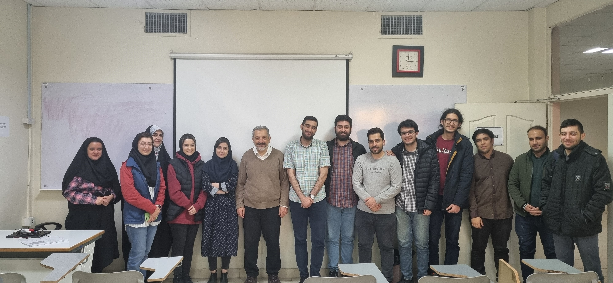

# CE5401: Advanced VLSI - Fall 2023

### Instructor: [Prof. Mehdi Sedighi](https://scholar.google.com/citations?user=2RN0Y2YAAAAJ&hl=en)
### E-mail: [msedighi@aut.ac.ir](mailto:msedighi@aut.ac.ir)

### Reference:
Neil H. E. Weste and D. M. Harris, *CMOS VLSI Design A Circuits and Systems Perspective,* 4th Edition, Addison-Wesley, 2011 ([find here](https://github.com/rezaAdinepour/M.Sc-AUT/tree/main/Advanced%20VLSI/Reference))
 
### Scores:
| Row | type | Portion |
| --- | :-:  | :-: |  
| 1 | Quiz & Assignment | 25% |
| 2 | Research | 25% |
| 3 | Project | 25% |
| 4 | Final | 25% |

## Last Class Session:
### Names of students from left to right:
-, Fatemeh Hasani, Fatemeh Barati, Parnian Sagheb, Fargheh Mahmoudian, **Prof. Mehdi Sedighi**, Amir Ali Roushanzadeh, Reza Adinepour, Saeed Rajabi, Amirreza Hoseini, Ehsan Moradi, Shayan Naghizadeh, Mohammad Mirzaei, Mohammad Mehdi Nemati

